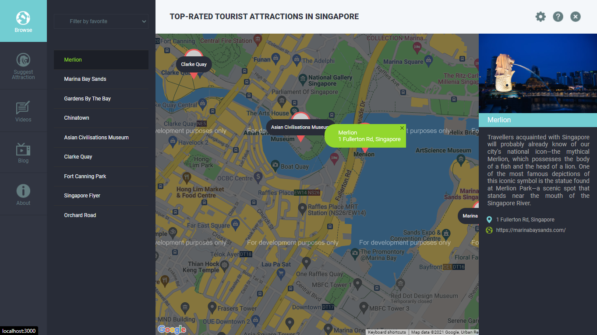

# Visit Singapore Web 


This project was bootstrapped with [Create React App](https://github.com/facebook/create-react-app) and 
[React-Google-Maps-Api](https://react-google-maps-api-docs.netlify.app/) for loading the map.

## Main Features
- All the pin ​ in the map can be clicked ​ and show different ​ description about the place.

## Getting Started
 To get a local copy up and running follow these simple steps.

### Prerequisites
You’ll need to have Node >= 10.16, npm >= 6+ or yarn >= 0.25+
```bash 
   npm install npm@latest -g
```
## Folders Structure

    ├── shoots                  # Documentation files (alternatively `doc`)
    ├── src                     # Source files 
         ├──  assets            
                └── icons
         ├──  components        
         ├──  data               
         └──  styles
    └── README.md

### Installation
- Get Google API Key at [here](https://console.cloud.google.com/apis/credentials/key)
- Clone the repo 
    ```bash 
    git clone https://github.com/diazamaliana/visit-singapore.git
    ```
- Go to the project directory 
    ```bash 
    cd visit-singapore
    ```
- Install NPM packages
    ```bash 
    npm install
    ```
- Rename `.env.example` to `.env`. Enter your API to your `.env`
    ```bash 
    REACT_GOOGLE_API_KEY= YOURGOOGLEAPIKEY
    ```
- In the project directory, you can run:

    ### `npm start`

    Runs the app in the development mode.\
    Open [http://localhost:3000](http://localhost:3000) to view it in your browser.

    The page will reload when you make changes.\
    You may also see any lint errors in the console.

    ### Deployment

    This section has moved here: [https://facebook.github.io/create-react-app/docs/deployment](https://facebook.github.io/create-react-app/docs/deployment)

    ### `npm run build` fails to minify

    This section has moved here: [https://facebook.github.io/create-react-app/docs/troubleshooting#npm-run-build-fails-to-minify](https://facebook.github.io/create-react-app/docs/troubleshooting#npm-run-build-fails-to-minify)
